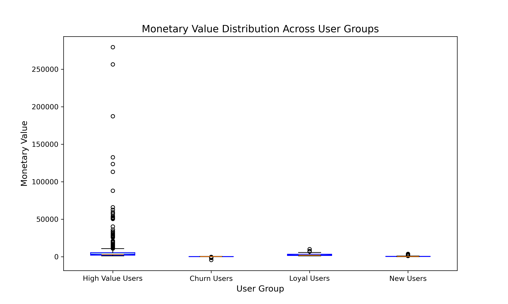
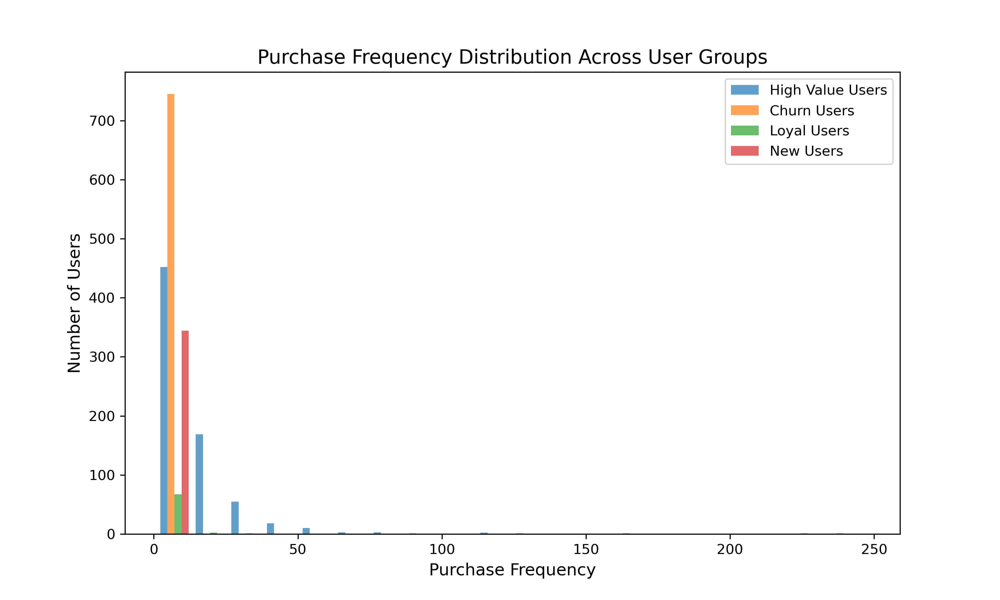

# 🛍️ 电商用户行为分析与流失预测

基于 RFM 模型的电商用户分群、价值分析和流失预测项目。

## 📊 项目概述

本项目使用某电商平台的交易数据，通过 **RFM 模型** 对用户进行分群，结合 **机器学习** 进行流失预测，为精细化运营提供数据支持。

### 核心分析内容

| 模块 | 方法 | 输出 |
|------|------|------|
| RFM 分析 | 用户价值分群 | 4 类用户群体 |
| 聚类分析 | KMeans | 3 个用户簇 |
| 流失预测 | 逻辑回归 | 流失概率预测 |
| SQL 分析 | 数据聚合查询 | 业务指标计算 |

## 📁 项目结构

```
ecommerce-user-analysis/
├── 📋 README.md                   # 项目说明文档
├── 📦 requirements.txt            # Python依赖包
├── 🚫 .gitignore                 # Git忽略规则
│
├── 🎨 assets/                     # 静态资源（README展示图片）
│   └── images/
│       ├── user_distribution.png
│       ├── user_clustering_kmeans.png
│       ├── monetary_distribution.png
│       ├── frequency_distribution.png
│       └── churn_prediction_accuracy.png
│
├── 🐍 src/                        # Python源代码
│   ├── rfm_analysis.py           # RFM模型实现
│   ├── visualization.py          # 可视化模块
│   └── churn_prediction.py       # 流失预测模型
│
├── 🗄️ sql/                        # SQL分析脚本
│   └── rfm_analysis.sql          # RFM分析的SQL实现
│
├── 📊 notebooks/                  # Jupyter Notebook
│   └── analysis.ipynb            # 交互式分析（可选但推荐）
│
├── 📄 reports/                    # 分析报告文档
│   └── analysis_report.md        # 详细分析报告
│
├── 💾 data/                       # 数据文件（不提交到Git）
│   └── .gitkeep                  # 占位文件
│
└── 📈 outputs/                    # 运行输出（不提交到Git）
    └── .gitkeep                  # 生成的图表放这里
```

**目录说明：**
- `assets/` - 存放README引用的预览图（必须提交）
- `src/` - 核心Python代码（必须提交）
- `sql/` - SQL脚本（展示SQL能力）
- `notebooks/` - Jupyter交互式分析（加分项）
- `reports/` - 分析文档
- `data/` & `outputs/` - 运行时数据，被gitignore忽略

## 🚀 快速开始

### 环境要求

- Python 3.8+
- pandas, numpy, matplotlib, seaborn
- scikit-learn

### 安装依赖

```bash
pip install -r requirements.txt
```

### 运行分析

```bash
# 运行完整分析流程
python src/rfm_analysis.py
python src/churn_prediction.py
```

## 📈 分析结果

### 1. RFM 用户分群

| 用户类型 | 数量 | 特征 | 运营策略 |
|---------|------|------|---------|
| **高价值用户** | ~720 | RFM=333，高消费、高频率、最近购买 | VIP服务、专属优惠 |
| **流失风险用户** | ~740 | RFM=111，很久没买、低频、低消费 | 召回活动、优惠券 |
| **忠实用户** | ~70 | 高频高消费但非最近 | 唤醒活动、新品推荐 |
| **新用户** | ~340 | 最近购买但低频 | 引导复购、会员权益 |

### 2. 流失预测模型

- **模型**: Logistic Regression
- **准确率**: ~85%
- **特征**: Recency, Frequency, Monetary
- **阈值**: Recency > 60 天定义为流失

### 3. 关键发现

1. **流失用户占比过高**: 约 35% 的用户有流失风险，需要重点关注
2. **忠实用户稀缺**: 仅 3% 的用户属于忠实用户群体，复购率待提升
3. **高价值用户维护**: 高价值用户与流失风险用户数量接近，需要防止高价值用户流失

---

## 📊 可视化结果

### 用户分群分布


*高价值用户与流失风险用户数量相当，忠实用户群体较小*

### KMeans 聚类分析


*用户在 Frequency 和 Monetary 维度呈现明显的群体分化*

### 消费金额分布



*不同用户群体的消费金额差异显著，高价值用户有明显的长尾特征*

### 购买频次分布



*大多数用户购买频次集中在 1-10 次，高价值用户频次更高*

### 流失预测模型


*逻辑回归模型准确率 85%+，可用于流失预警*

---

## 🛠️ 技术栈

- **数据处理**: pandas, numpy
- **可视化**: matplotlib, seaborn
- **机器学习**: scikit-learn (KMeans, LogisticRegression)
- **数据库**: SQL (SQLite/MySQL 示例)

## 📝 SQL 分析示例

项目包含完整的 SQL 分析脚本，展示如何用 SQL 实现：
- RFM 指标计算
- 用户分群统计
- 流失用户识别
- 月度销售趋势

详见 `sql/rfm_analysis.sql`

## 🎯 业务建议

### 短期行动
1. **流失预警**: 对 Recency > 45 天的用户发送召回邮件
2. **高价值维护**: 为 RFM=333 用户提供专属客服
3. **新用户转化**: 首购后 7 天内推送复购优惠

### 长期策略
1. 建立用户生命周期管理体系
2. A/B 测试不同召回策略效果
3. 引入更复杂的预测模型（XGBoost、深度学习）

## 📄 数据来源

- 数据集: Online Retail Dataset
- 时间跨度: 2010-12-01 至 2011-12-09
- 记录数: 541,909 条交易记录
- 用户数: 4,372 名独立用户

## 👤 作者

**世茵**  
湘潭大学 | 信息管理与信息系统  
📧 flowersstudy@example.com

## 📜 License

MIT License
